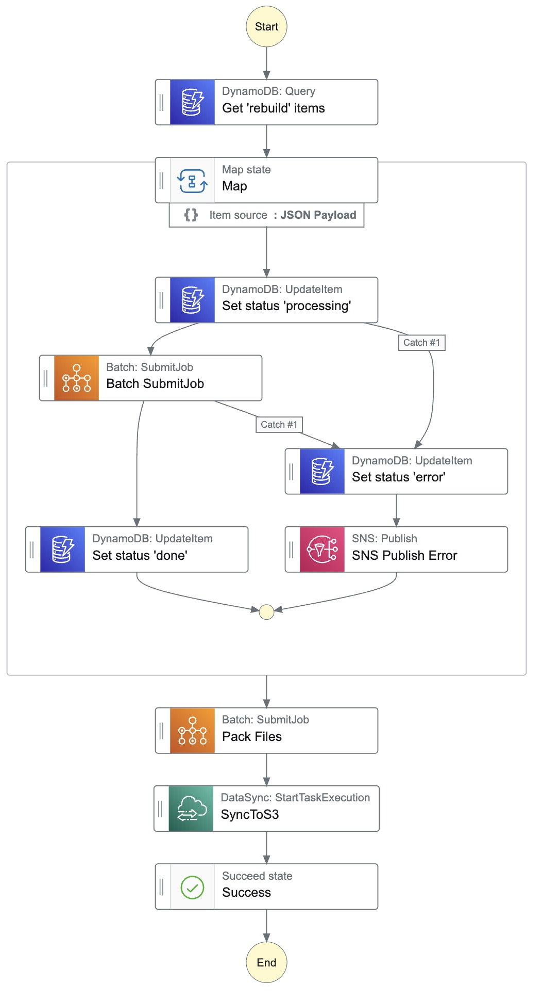
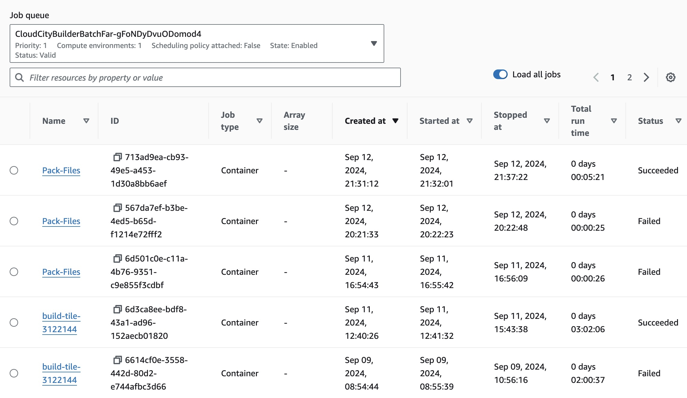
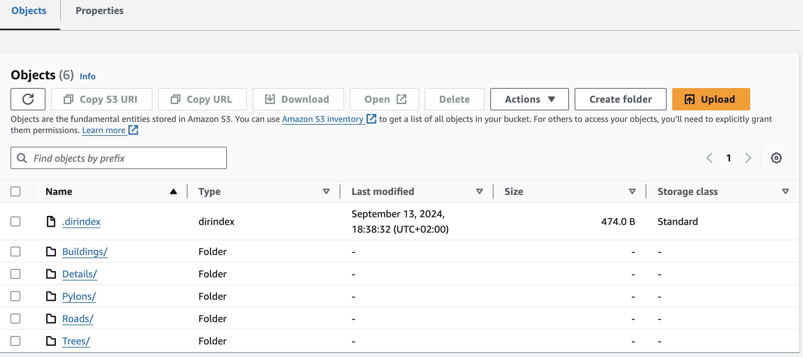

# CloudCity - build osm2city in the cloud
Goal of this project: Build a scalable and efficient system for generating OSM2City data on AWS.  This system should be able to handle large amounts of data and provide a user-friendly interface for users to trigger a tile rebuild and see  the status of the rebuild process.

Osm2city is a collection of python  scripts that can be used to generate FlightGear scenery from OpenStreetMap data. It queries  the OpenStreetMap database, extracts the relevant data, and then generates the scenery data in a format usable by FlightGear flight simulator.

This repository  contains the code for the CloudCity infrastructure. It is composed using the AWS CDK so it can be  easily deployed to AWS by anybody with  an AWS account.

**WARNING**: Upon deployment of the CDK stack, a lot of infrastructure gets provisioned. Almmost everything is *serverless* without any running costs without being used.  However, the cost of the AWS services used can be substantial if the system is used extensively. Make sure you know how to monitor  and control costs before deploying this system.

## Installation
###  Prerequisites
- AWS account - you might want to use a fresh one for this project.
- AWS CLI installed and configured
- Node.js  installed (for the AWS CDK)
- Install AWS CDK, follow the "getting started" instructions  on the [AWS CDK Documentation](https://docs.aws.amazon.com/cdk/v2/guide/getting_started.html)
- Bootstrap your CDK environment, follow the "bootstrapping" instructions on  the [AWS CDK Documentation](https://docs.aws.amazon.com/cdk/v2/guide/bootstrapping.html)
### Deploying the Stack
- Install the required packages, run `npm install` in the `cdk` folder of this repository.
- Log in to your AWS account on the command line or set up a profile
- Deploy the stack by running `AWS_PROFILE=<your-profile> npx cdk deploy --context image-tag=latest` inside the `cdk` folder.
- The stack will be deployed to your AWS account. You can monitor the deployment process in the AWS
- Once the stack has been deployed, go to the `docker` folder and build the osm2city image, use the commands shown in the next step:
- Open the AWS console, open the Elastic Container Repository service. Open the `cloudcity` repository and click "View push commands", follow the steps described  there to push the image to the repository.
- You should now have  a running osm2city system in the cloud.
## The User Interface
- The user interface is a simple web application that allows users to trigger a tile rebuild. The URL for is available as an Output of the CloudFormation stack. Open the AWS CloudFormation Console, select the CloudCityBuilder stack and check the "Outputs" Tab. There is a key "UIDistributionOut" which contains the DNS-Name for the CloudFront distribution.
## The Backend
Open the Step Functions/StateMachines AWS console.  There you can see the state machine that is used to trigger the tile rebuild. Open the StateMachine and click on "Start Execution". This will start the machine and trigger a rebuild of all tiles flagged in the DynamoDB table.
## URL Endpoints
- https://XXXXXX.cloudfront.net/ - the user interface
- GET https://XXXXXX.cloudfront.net/api/tile/nnnnnn - get the status of a single tile
-  GET https://XXXXXX.cloudfront.net/api/1x1/e009n11 - get the status of all tiles within a 1x1 degree area
- GET https://XXXXXX.cloudfront.net/api/10x10/e000n00 - get the status of all tiles within a 10x10 degree area
- https://XXXXXX.cloudfront.net/ws2.0/o2c-packed/ - generated scenery in terrasync compatible format (.dirindex and .txz files)

## Screenshots

